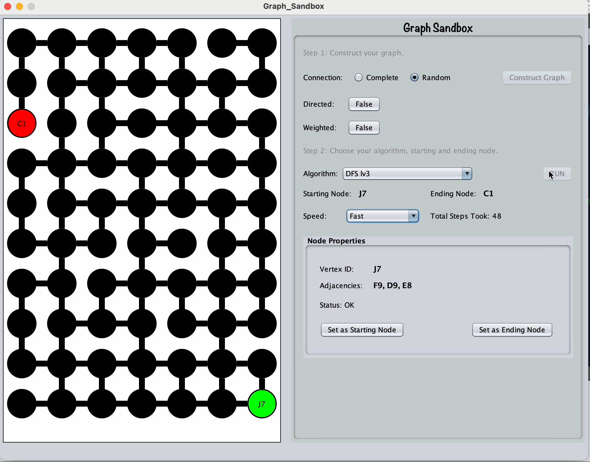

<h1>Graph SandBox</h1>

This is a Graph Data Structure Visualization Desktop GUI! This project offers an interactive platform where you can explore and manipulate graph structures with ease. By utilizing this GUI, you gain the understanding of various Graph Algorithms, including Depth First Search, Breadth First Search, and Heuristic.
 

<h6>Author: Samnang Thorn</h6>
